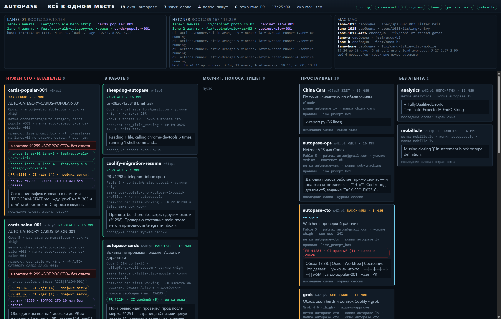

# sheepdog-autopase — доска «Autopase в одном месте»

Живая доска, на которой видно всю разработку autopase.lv сразу: какие окна
открыты, что каждое сейчас делает, на какой полосе пишется код, что с
открытыми PR и не ждёт ли кто-то слова CTO или владельца.

Это форк [sheepdog](https://github.com/patraianton/sheepdog) — общей доски для
любого набора окон herdr. Здесь она переделана под один проект: показываются
только окна autopase, и на карточке лежат вещи, которых в общей доске нет —
полосы, PR, зонтичные issue.

Общая доска sheepdog осталась в этом же репозитории (`bin/board-server.mjs`,
`bin/board.cmd`, порт 4877) — её никто не трогал, она может работать рядом.



---

## Как запустить

Нужны: Windows, Node.js 18+, herdr, `gh` (вход выполнен), ключ `~/.ssh/id_ed25519`
для серверов с полосами.

    bin\autopase-board.cmd

Доска откроется на `http://127.0.0.1:4878` и дальше обновляется сама раз в три
секунды. Без окна консоли (например, в автозапуск при входе в Windows) —
`bin\autopase-board-hidden.vbs`.

Другой порт: `set AUTOPASE_BOARD_PORT=4900` перед запуском.

---

## Что на доске

**Верхняя строка** — сколько окон autopase открыто, сколько ждут слова, сколько
полос пишет код прямо сейчас, сколько открытых PR. Справа — лампочки источников
данных: зелёная значит «источник ответил», красная — «не ответил» (наведите
мышью, чтобы увидеть текст ошибки). Доска при этом продолжает работать: каждый
источник живёт отдельно и падение одного не гасит остальные.

**Полоса под шапкой** — три места, где пишется код: **lanes-01**
(`root@2.29.10.164`), **Hetzner** (`root@89.167.116.229`) и **Mac**. Для каждой
полосы видно, занята она или свободна, какая ветка на ней лежит и какое окно за
неё отвечает. Полоса, которая занята, но ни к какому окну не привязалась,
подписана «ничья» — это повод разобраться.

**Колонки:**

| колонка | что в ней |
|---|---|
| **Нужен CTO / владелец** | окно `blocked`, либо в его последних словах есть «ВОПРОС CTO» / «ОТВЕТ ВЛАДЕЛЬЦУ», либо такой комментарий висит в зонтичном issue без ответа. Всегда первая — это то, что стоит без человека |
| **В работе** | окно сейчас работает |
| **Молчит, полоса пишет** | окно молчит, но его полоса занята — работа идёт не в окне, а на сервере |
| **Простаивает** | окно с живым агентом, но без работы и без полос |
| **Без агента** | окно есть, агента в нём нет (herdr вернул `unknown`) |

**Карточка = одна вкладка herdr.** На ней:

- имя рабочей копии и место в herdr (`w5A:p1`);
- состояние (работает / ждёт / заблокировано / закончило) и **сколько времени
  оно держится**;
- по какому правилу herdr так решил (`agent explain`) и по какому куску экрана —
  наведите мышью, чтобы увидеть область и приоритет правила;
- модель, учётная запись, усилие и заполненность контекста — прочитаны с нижней
  строки экрана окна;
- ветка рабочей копии (или «голова отсоединена», если ветки нет);
- **полосы**, на которых пишется код этого потока, с их ветками;
- **открытые PR** с цветом CI: зелёный / красный / «CI идёт». Подписано, откуда
  взялась привязка: «ветка окна», «префикс ветки», «ветка полосы» или «названо
  окном»;
- **зонтичный issue** программы и висит ли в нём вопрос без ответа;
- **последние слова окна** — что оно сказало последним.

**Клик по карточке** переводит herdr на эту вкладку. Это единственное действие
доски: больше она ничего никуда не пишет.

---

## Откуда берутся данные

Руками не вводится **ничего**. Всё читается заново при каждом обновлении:

| что | откуда | как часто |
|---|---|---|
| окна, вкладки, состояние агента | `herdr api snapshot`, `herdr workspace list`, `herdr agent list` | каждые 3 с |
| правило состояния | `herdr agent explain <панель>` | каждые 12 с |
| модель, учётка, усилие, контекст, номера PR на экране | `herdr pane read <панель> --source visible` | каждые 12 с |
| полосы lanes-01 и Hetzner | `ssh … hzlane status` | каждые 45 с |
| полосы Mac | `ssh mac` — ветка каждой папки `~/kitchens/autopase.lv/lane-*` плюс рабочая папка живых процессов `codex exec` | каждые 45 с |
| открытые PR и цвет CI | `gh pr list --repo Baltic-OrangesLV/vincheck-latvia` | каждые 60 с |
| зонтичные issue и вопросы в них | `gh issue list --label umbrella` + `gh issue view` | каждые 120 с |
| какое окно за какие полосы и ветки отвечает | `autopase-ops/reports/active-session-monitor/STREAM-WATCH.json` | каждые 30 с |
| номер зонтичного issue | `_conveyor/autopase.lv/specs/<ПРОГРАММА>/PROGRAM-STATE.md`, строка `umbrella: #NNNN` | каждые 30 с |
| последние слова окна | журнал сессии Claude (`*.jsonl`); если текущая сессия ещё ничего не сказала вслух — журнал прошлой сессии этого же окна; если и там пусто — последняя содержательная строка с экрана | каждые 3 с (по времени изменения файла) |

Единственное, что доска хранит сама, — `state/autopase-seen.json`: когда каждая
панель впервые оказалась в нынешнем состоянии. Без этого не посчитать «сколько
времени окно так стоит»: herdr время в состоянии не хранит.

**Доска только читает.** Она не запускает и не останавливает полосы, ничего не
пишет в чужие окна herdr, не трогает боевую базу, Vercel и Coolify. По ssh
выполняются только `hzlane status`, `pgrep`, `git rev-parse` и `lsof`.

---

## Настройки

По умолчанию всё уже прописано в `bin/autopase-board.mjs` (раздел `DEFAULTS`).
Переопределить, ничего не трогая в коде, можно файлом `state/autopase-board.json`
(он не в git):

```json
{
  "match": "autopase",
  "hide": ["seo"],
  "repo": "Baltic-OrangesLV/vincheck-latvia",
  "askWords": ["ВОПРОС CTO", "ОТВЕТ ВЛАДЕЛЬЦУ"],
  "answerWords": ["ОТВЕТ CTO", "РЕШЕНИЕ CTO"],
  "hosts": {
    "lanes-01": { "target": "root@2.29.10.164", "key": "id_ed25519", "kind": "hzlane" },
    "hetzner":  { "target": "root@89.167.116.229", "key": "id_ed25519", "kind": "hzlane" },
    "mac":      { "target": "mac", "kind": "mac", "kitchen": "~/kitchens/autopase.lv" }
  }
}
```

- `match` — окно попадает на доску, если его рабочая папка содержит это слово.
- `hide` — что не показывать. По слову владельца окно `seo` — маркетинг, а не
  разработка, и на доске разработки ему не место.
- `askWords` — по каким словам окно считается ждущим человека.
- `answerWords` — какими словами вопрос в зонтике закрывают. Пока в зонтике
  после вопроса не появится комментарий с таким словом, вопрос считается
  висящим (в зонтике пишет одна учётная запись, по автору ответ не отличить).

---

## Чего доска не умеет

- Привязать PR к окну, если ветка PR не похожа ни на ветку окна, ни на префиксы
  из `STREAM-WATCH.json`, и окно нигде не назвало его номер. Такой PR просто не
  появится ни на одной карточке.
- Показать полосу, которой нет ни в `hosts`, ни среди папок `lane-*` на Mac.
- Отличить «человек ответил на вопрос в зонтике» от «поток сам дописал отчёт»,
  если ответ не помечен словом из `answerWords`.
- Понять, что делает окно без агента Claude: для них показывается только
  последняя строка экрана.

---

## Лицензия

MIT — см. `LICENSE`. Исходная доска: [sheepdog](https://github.com/patraianton/sheepdog).
